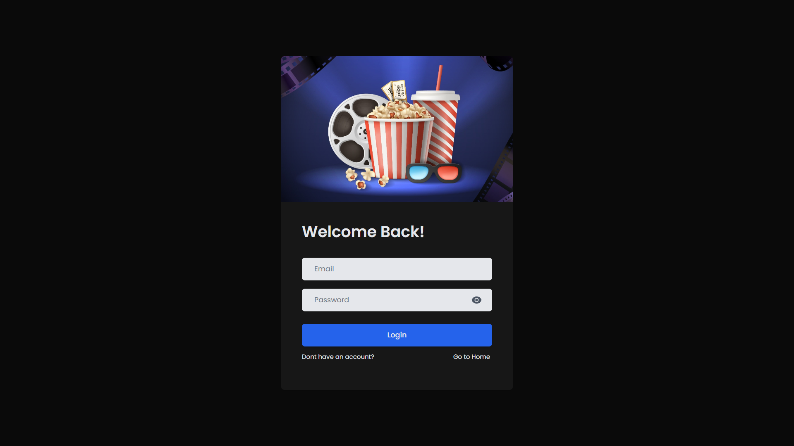
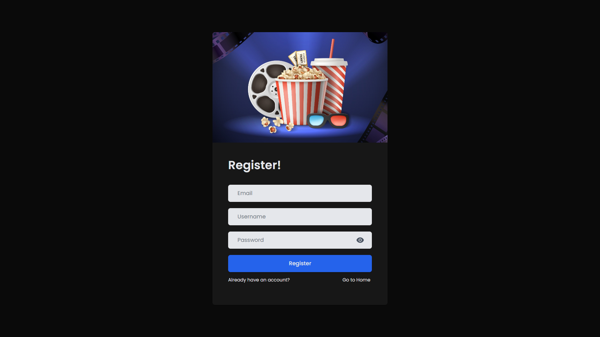
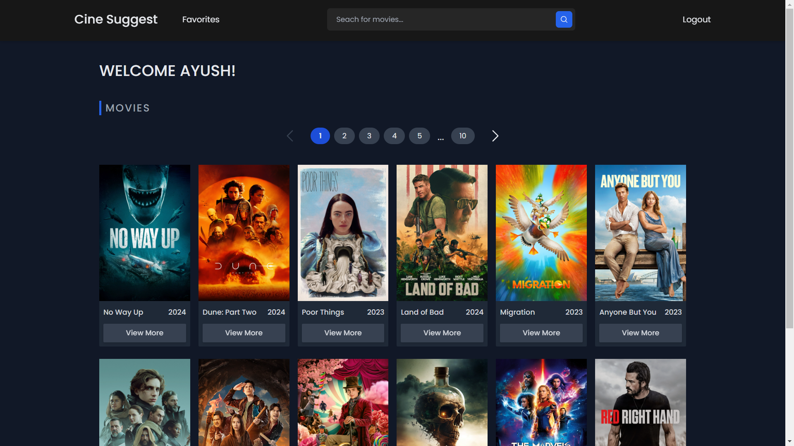
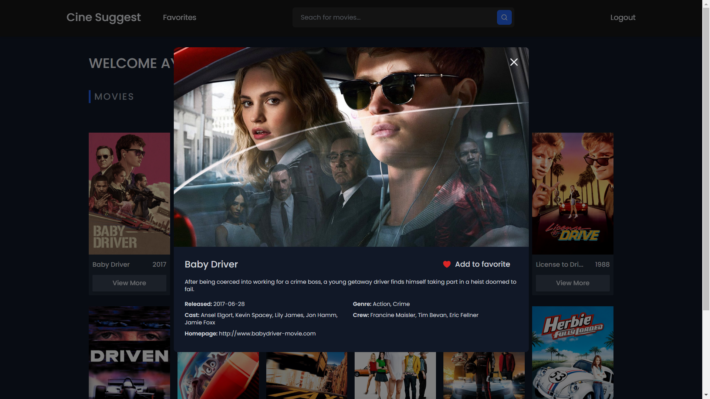
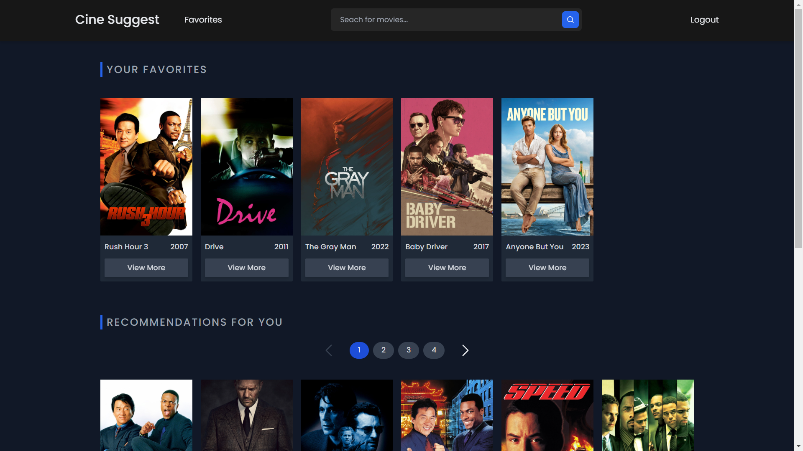
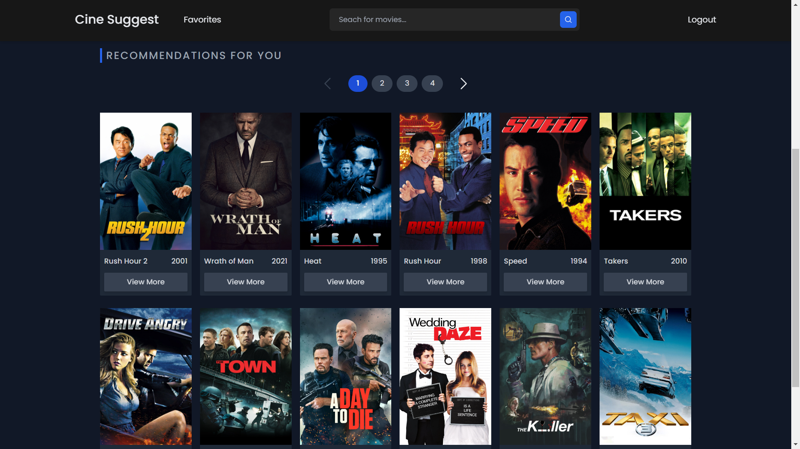

# Cine Suggest: Semantic Movie Search and Recommender App

Welcome to Cine Suggest, a platform for exploring and discovering movies tailored to your preferences. This application combines the power of semantic search and recommendation algorithm to enhance your movie-watching experience.

## Table of Contents

1. [Overview](#overview)
2. [Features](#features)
3. [Technologies Used](#technologies-used)
4. [Installation](#installation)
5. [Usage](#usage)
6. [Contributing](#contributing)
7. [Screenshots](#screenshots)
8. [Contact](#contact)

## Overview

Cine Suggest is a web application designed to provide users with a seamless experience in searching for movies, liking their favorites, and receiving personalized recommendations. With advanced semantic search powered by the SBERT model and recommendation algorithm based on user preferences, Cine Suggest aims to revolutionize the way you discover and enjoy movies.

## Features

- **Authentication:** Secure user authentication provided by Firebase, ensuring a safe and personalized experience.
- **Search Movie:** Effortlessly search for movies using our semantic search functionality.
- **Like Movie:** Like your favorite movies to receive recommendations tailored to your taste.
- **Find Recommendations:** Explore personalized movie recommendations based on your likes and preferences.

## Technologies Used

- **Frontend:** React
- **Styling:** Tailwind CSS
- **Backend:** Python
- **Database:** Firestore
- **Authentication:** Firebase
- **Vector Database:** Pinecone
- **Semantic Search Model:** SBERT

## Installation

1. **Clone the repository:**

    ```bash
    git clone https://github.com/AyushK-26/Cine-Suggest
    cd cine-suggest
    ```

2. **Create `.env` files:**

    Create `.env` files in client and in server directory and populate it with the necessary environment variables.

3. **Build and run the application:**

    ```bash
    docker-compose up -d
    ```

    This command will start the web and api services defined in the `compose.yaml` file.

4. **Access Cine Suggest:**

    Open your browser and visit [http://localhost:5173](http://localhost:5173) to access Cine Suggest.

## Usage

Once the installation is complete, you can use Cine Suggest by following these simple steps:

1. Sign in to your account or create a new one.
2. Explore movies using the semantic search functionality on the home page.
3. Like your favorite movies to receive personalized recommendations.
4. Navigate to the favorites section to discover movies tailored to your taste.
5. Enjoy exploring and finding recommendations on Cine Suggest!

## Contributing

Contributions are welcome! Follow these steps to contribute:

1. Fork the repository.
2. Create a new branch for your feature or bug fix: `git checkout -b feature/new-feature`.
3. Commit your changes: `git commit -m 'Add new feature'`.
4. Push to the branch: `git push origin feature/new-feature`.
5. Open a pull request.

## Screenshots

### Login Page


### Register Page


### Home Page


### Movie Modal


### Favorites Section


### Recommendations Section


## Contact

If you have any questions or suggestions regarding the Cine Suggest App, feel free to reach out:

- **Email:** [ayushkhanduri2612@gmail.com](mailto:ayushkhanduri2612@gmail.com)
